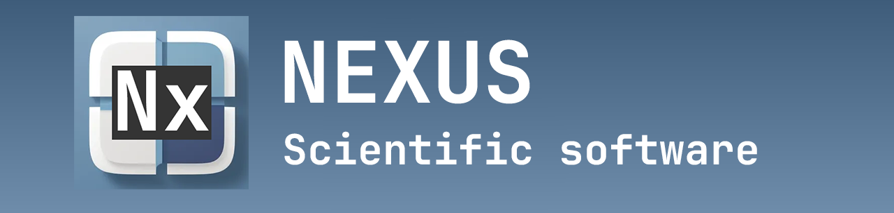
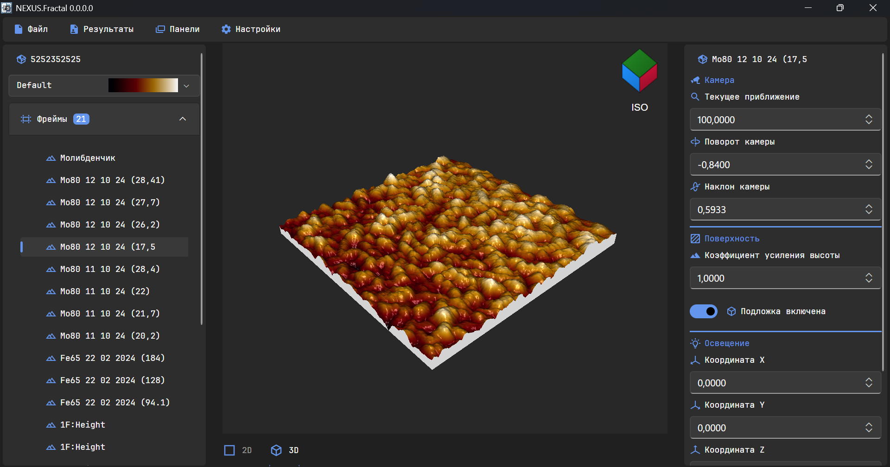

# NEXUS

Scientific software for working with MDT, BCR and image files of SEM (AFM and STM) microscope data.

# Future plans
- [x] Add parsing of MDT and BCR files :tada:
- [x] Add visualization of 3d surface using OpenGL :tada:
- [ ] [Add scale-axis to 3d surface view](https://github.com/Talwok/NEXUS/issues/7)
- [ ] [Add scale-axis to 2d surface view](https://github.com/Talwok/NEXUS/issues/8)
- [ ] [Add new math functions to surface transformation and analysis](https://github.com/Talwok/NEXUS/issues/9)

# Showcase

# Credits
<ul>
    <a href="https://github.com/AvaloniaUI/Avalonia">Avalonia</a>
    <a href="https://github.com/amwx/FluentAvalonia">Fluent Avalonia UI</a>
    <a href="https://github.com/beto-rodriguez/LiveCharts2">LiveCharts 2</a>
    <a href="https://pictogrammers.com/library/mdi/">Material Design Icons</a>
</ul>

